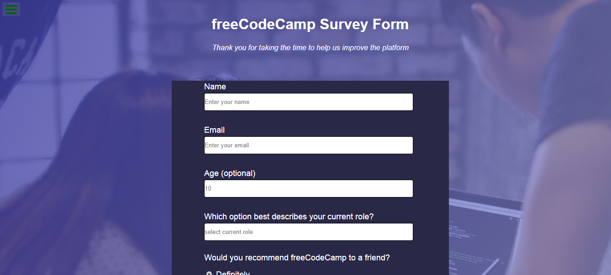

# SURVEY-FORM

It is the frontend clone for freecodecamp page. The page has a form with input elements which have validation features made through the HTML. There are buttons on the page with and text in them directing the user to carry out actions that include submitting form details. Users are able to input information into the form. 

# Built With

- HTML
- CSS

# Live Project

[Live Project](https://rawcdn.githack.com/nellencr/Form-for-Collecting-Data/873cdfe89323cac41d8c7066f216193839717ab8/index.html)

## Getting Started

You may use the following steps to get a local copy:

- Clone project to your local machine
- `cd` to the project directory
- Open project in IDE
- Open Live Preview through IDE or use localhost to view the project in your browser

👤 **Author**

- Github: [@nellencr](https://github.com/nellencr)
- Twitter: [Nella](https://twitter.com/Nella75794271)
- Linkedin: [Nela Komane](https://www.linkedin.com/in/nela-komane-8866b9192/)

## Show your support

Give a ⭐️ if you like this project!